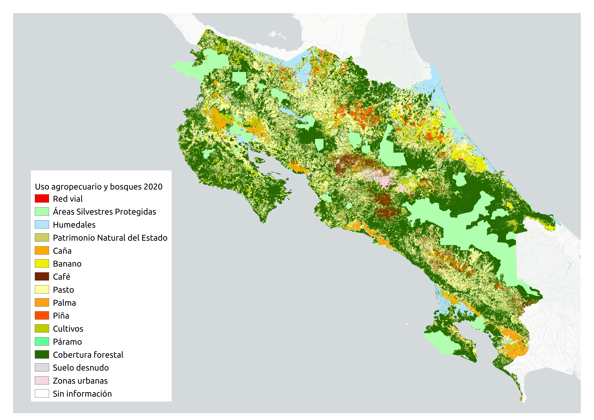

# Desarrollo de un mapa base de uso agropecuario y bosques a nivel nacional del año 2020
Este repositorio contiene el código fuente en lenguaje R y la documentación para generar un mapa base de uso agropecuario y bosques de Costa Rica correspondiente al año 2020. El mapa se crea a partir de la combinación de capas vectoriales y raster de cobertura forestal, cultivos, áreas silvestres protegidas y otras.



## Flujo de trabajo

1. Remuestreo de capas raster: `programas/remuestreo.R`
    - Entradas
        - Directorio de capas raster originales: `datos/originales/raster`
    - Salidas
        - Directorio de capas remuestreadas: `datos/procesados/remuestreados`
        
2. Rasterización de capas vectoriales: `programas/rasterizacion.R`
    - Entradas
        - Directorio de capas vectoriales originales: `datos/originales/vectoriales`
    - Salidas
        - Directorio de capas rasterizadas: `datos/procesados/rasterizados`
        
3. Combinación de capas remuestreadas y rasterizadas: `programas/combinacion.R`
    - Entradas
        - Directorio de capas rasterizadas: `datos/procesados/rasterizados`
        - Directorio de capas remuestreadas: `datos/procesados/remuestreados`
    - Salidas
        - Archivo raster de capa de uso agropecuario y bosques: `salidas/uso-agropecuario-bosques-2020.tif`
        
4. Reclasificación de la capa combinada: `programas/reclasificacion.R`
    - Entradas
        - Archivo raster de capa de uso agropecuario y bosques: `salidas/uso-agropecuario-bosques-2020.tif`
    - Salidas
        - Archivo raster de capa de uso agropecuario y bosques reclasificado: `salidas/uso-agropecuario-bosques-reclasificado.tif`
        
5. Compresión de la capa reclasificada: `programas/compresion-salidas.sh`
    - Entradas
        - Archivo raster de capa de uso agropecuario y bosques reclasificado: `salidas/uso-agropecuario-bosques-reclasificado.tif`
    - Salidas
        - Archivo raster de capa de uso agropecuario y bosques reclasificado comprimido: `salidas/uso-agropecuario-bosques-2020-reclasificado-comprimido.tif`
        
6. Generación de estadísticas: `programas/generacion-estadisticas.R`
    - Entradas
        - Archivo raster de capa de uso agropecuario y bosques reclasificado comprimido: `salidas/uso-agropecuario-bosques-2020-reclasificado-comprimido.tif`
    - Salidas
        - Archivo CSV con estadísticas: `salidas/estadisticas.csv`

## Manejo del contenedor Docker

### Generación de la imagen a partir del archivo Dockerfile
```shell
# Generación de la imagen Docker a partir del archivo Dockerfile
docker build -t mapa-agropecuario-bosques-r-433 .
```

### Ejecución del contenedor
```shell
# Ejecución del contenedor Docker
# (el directorio local debe especificarse en la opción -v)
# (el archivo con variables de ambiente debe especificarse en la opción --env-file)
docker run -d --name mapa-agropecuario-bosques-r-433 \
  -p 8787:8787 \
  -v /home/mfvargas/mapa-agropecuario-bosques/github/2020:/home/rstudio \
  --env-file /home/mfvargas/mapa-agropecuario-bosques-r-433.env \
  mapa-agropecuario-bosques-r-433
```
  
### Acceso al contenedor (username=rstudio, password=biodatacr)
[http://localhost:8787](http://localhost:8787)

### Detención, inicio y borrado del contenedor
```shell
# Detención del contenedor Docker
docker stop mapa-agropecuario-bosques-r-433

# Inicio del contenedor Docker
docker start mapa-agropecuario-bosques-r-433

# Borrado del contenedor Docker
docker rm mapa-agropecuario-bosques-r-433
```

### Ejemplo de contenido del archivo `mapa-agropecuario-bosques-r-433.env`
(deben asignarse valores adecuados a las variables)
```shell
# Clave para ingresar a RStudio
PASSWORD=mapa
```
