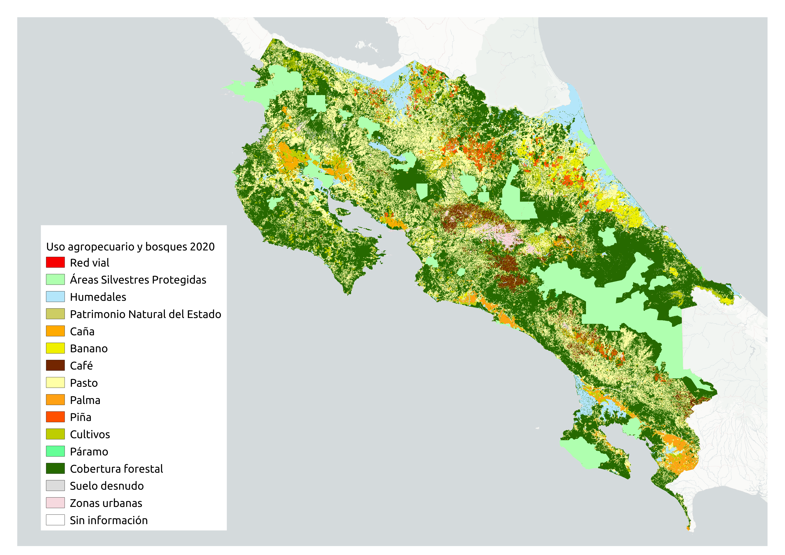

Este sitio web y su correspondiente [repositorio en GitHub](https://github.com/mapa-agropecuario-bosques/2020) contienen el código fuente utilizado para generar un mapa base de uso agropecuario y bosques de Costa Rica correspondiente al año 2020. El mapa se muestra en la @fig-mapa-uso-agropecuario-bosques-2020.

{#fig-mapa-uso-agropecuario-bosques-2020 .lightbox fig-alt="Mapa de uso agropecuario y bosques de Costa Rica para el año 2020" fig-align="center"}

El mapa es el producto de la combinación de capas vectoriales y raster de cobertura forestal, cultivos, áreas silvestres protegidas y otras.